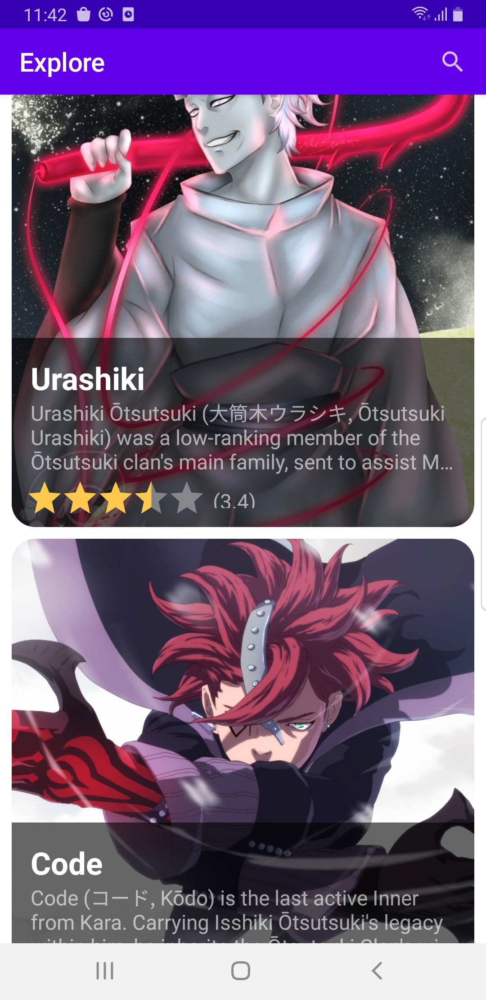
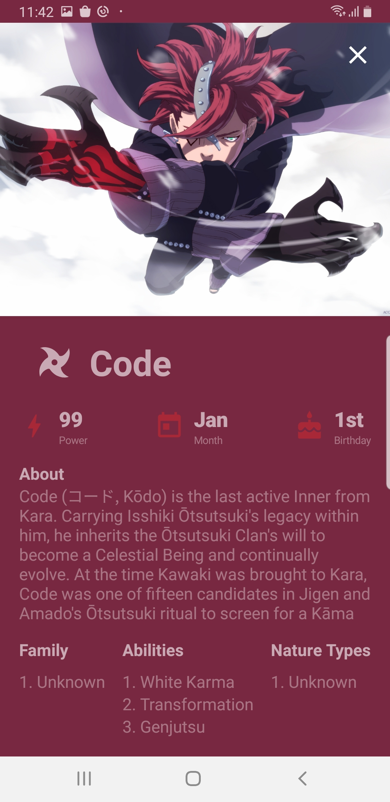
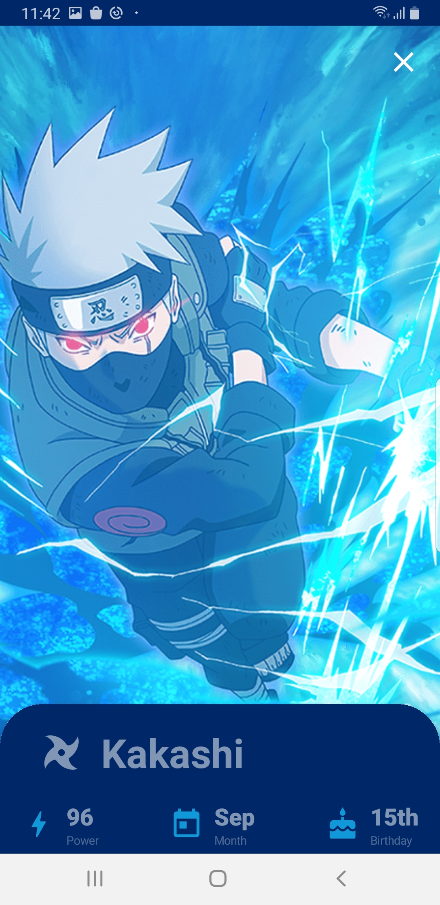

# Naruto-Glossary

App that communicates with the naruto glossary backend server. 

## The Brief

App comunicates with a backend developed in 
https://github.com/ArtemisSoftware/Naruto-Glossary-Server

The app will also be able to automatically store and cache that data from the server into a Local ROOM database.
That way it will be able to load the data, even when there is no internet connection.

## Architecture & Libraries

    - Clean Architecture + Use Cases
    - Paging 3 Library with Jetpack Compose
    - Offline Caching with Remote Mediator
    - Work with multiple Paging Sources in Android Studio
    - ROOM as a Local Database
    - Dependency Injection with Dagger-Hilt
    - Compose Navigation
    - Swipe to Refresh
    - Testing Custom UI Components
    - Shimmer Effect
    - Palette API
    - MVVM
    - Retrofit
    - Coil Image Loading Library

## App preview:

Image #1            |  Image #2             |  Image #3           
:-------------------------:|:----------------------------:|:----------------------------:
    |       |   

